# xgboost-estimator

This code is used for training and deploying inbuilt XGBoost estimator using AWS Sagemaker 

## Create the environment from .yml file

   - conda env create -f env.yml
   
   The environment file consists of all the required dependencies to be installed

## Activate the environment created

   - conda activate sagemaker-env
   
## Make sure to add your credentials in the file ~/.aws/credentials

   [default]
   
   aws_access_key_id = 'your_access_key'
   
   aws_secret_access_key = 'your_secret_key'

## inbuilt-xgboost-model.ipynb

   This notebook consists of code for training and deploying inbuilt XGBoost estimator
   
## Sequence of Steps listed in the notebook:

   - Import Libraries
   - Create XG Boost Estimator
   - Create Hyperparameter Tuning Job
   - Associate the Tuning Job to Sagemaker Experiment
   - Select the Best model
   - Create Debugger Config using Best Model
   - Visualize feature importance and performance metrics
   - Endpoint creation
   - Make a request to the endpoint
   
   - Endpoint-URL: https://runtime.sagemaker.us-east-2.amazonaws.com/endpoints/xgboost-inference-pipeline-ep-2021-05-04-13-07-23/invocations

   
## Charts created using Sagemaker Experiments:

### x-axis: num_round, y-axis: train:rmse

  

  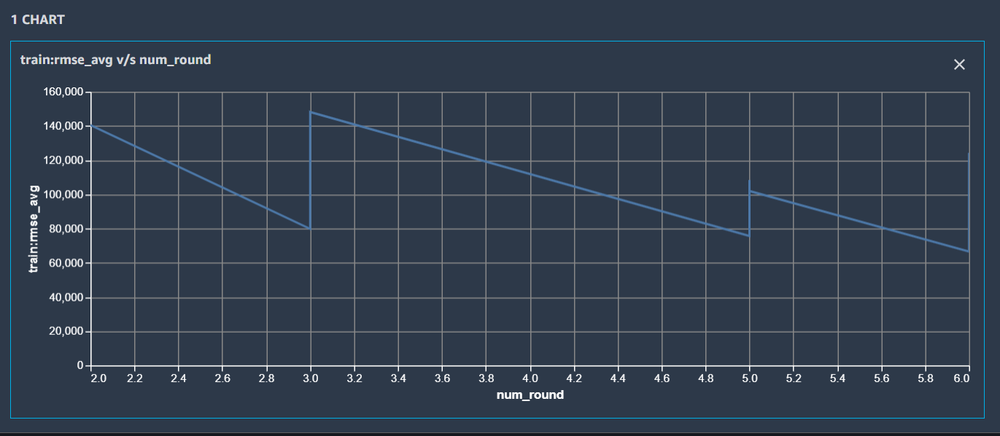
  

  
### x-axis: num_round, y-axis: validation:rmse

  

  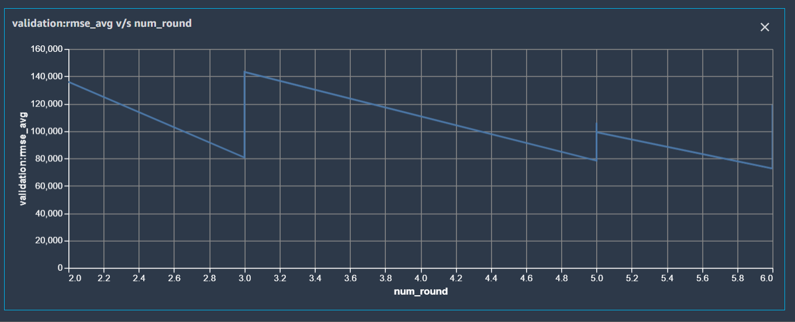
  

  
### x-axis: gamma, y-axis: train:rmse

  

  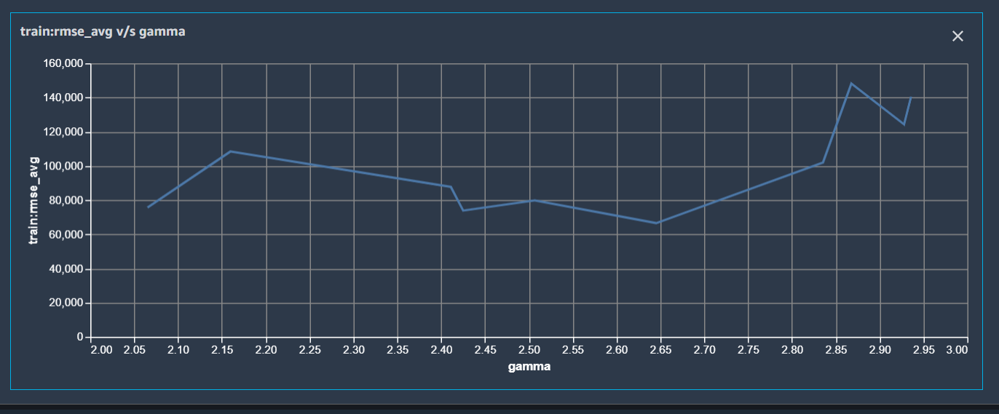
  

  
### x-axis: gamma, y-axis: validation:rmse

  

  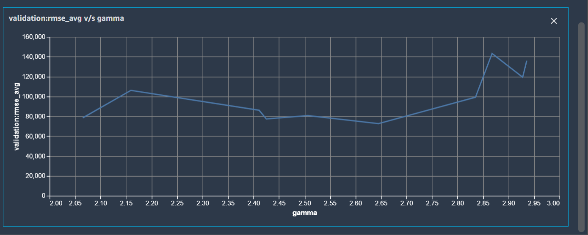
  

  
### x-axis: eta, y-axis: train:rmse

  

  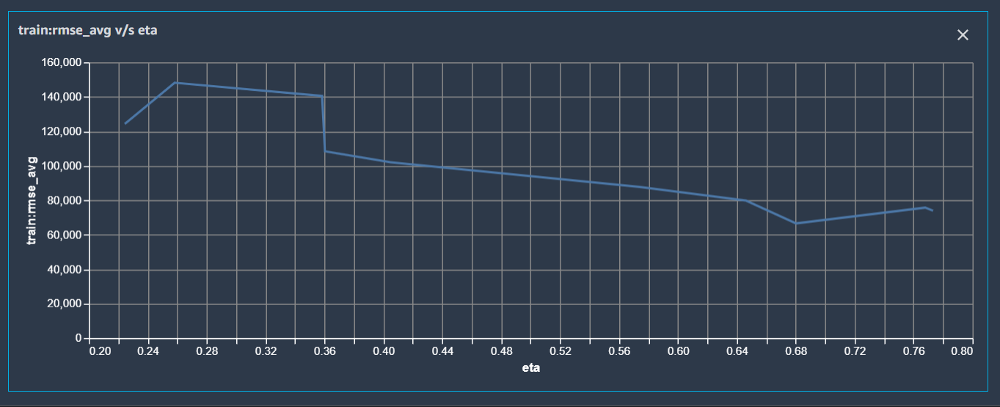
  

  
### x-axis: eta, y-axis: validation:rmse

  

  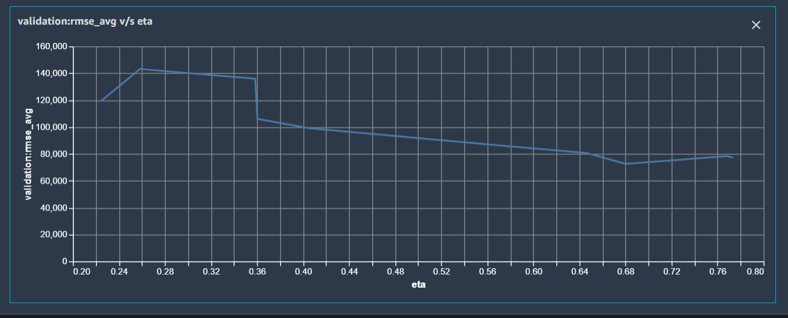
  

  
### x-axis: max_depth, y-axis: train:rmse

  

  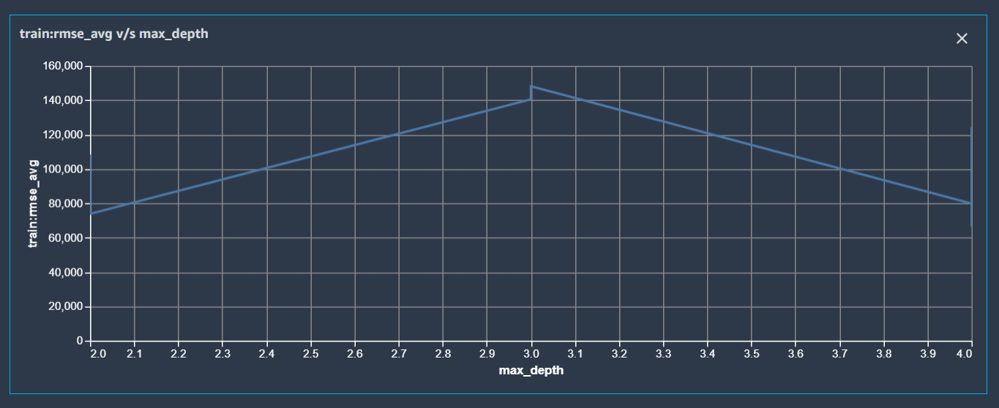
  

  
### x-axis: max_depth, y-axis: validation:rmse

  

  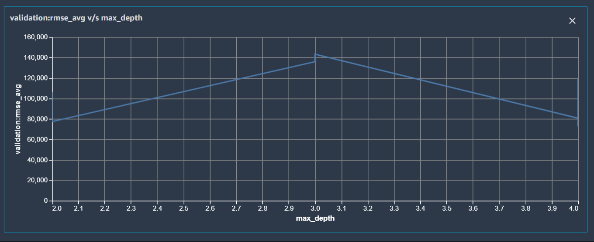
  

  
## Billing Report - grouped by service 

  The Billing Report can be viewed grouping by service 

  - Inbound Rules 
  

  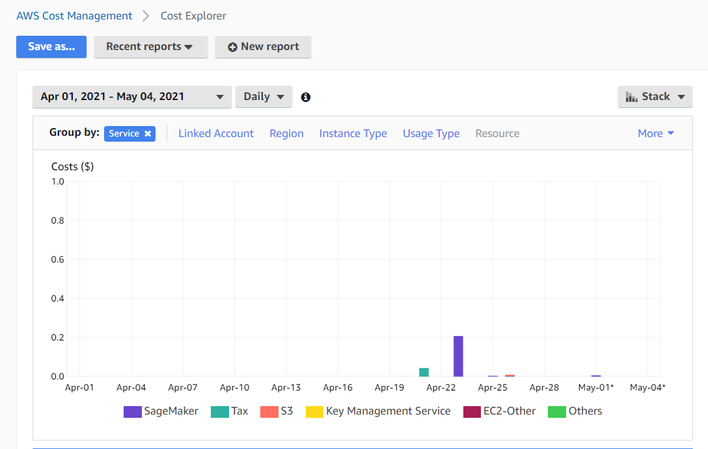
  

## Billing Report - grouped by tags 

  The Billing Report can be viewed grouping by tags 

  - Inbound Rules 
  

  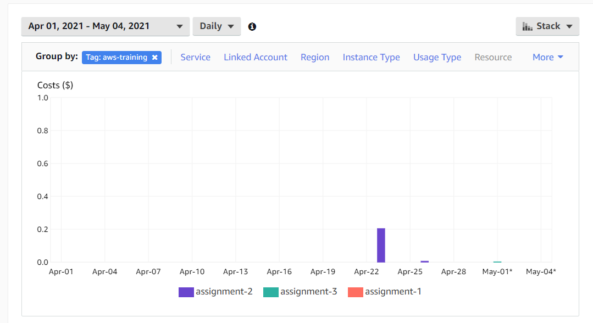
  

## Free Tier Usage 
  
  - Data Transfer Usage

  

  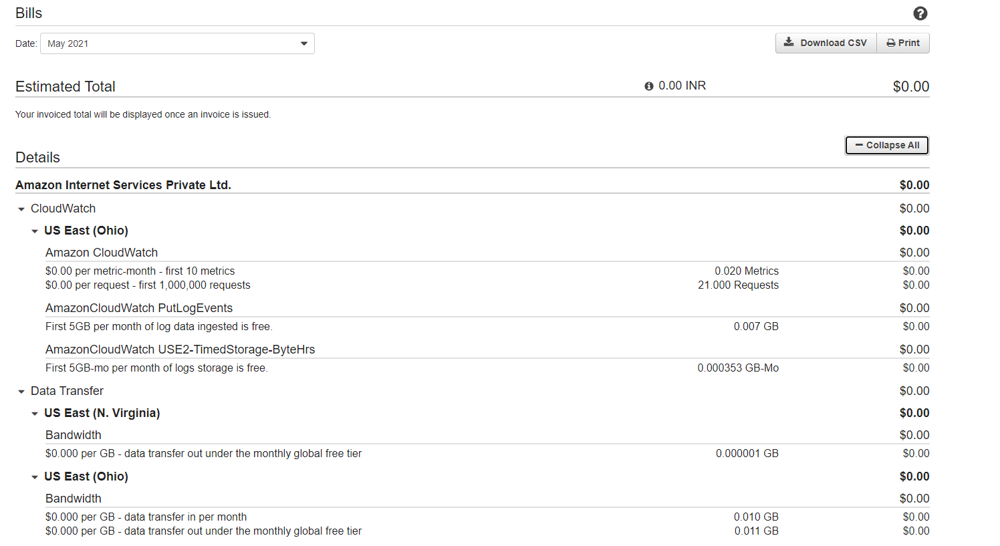
  

  - Sagemaker and S3 Usage
 
   

  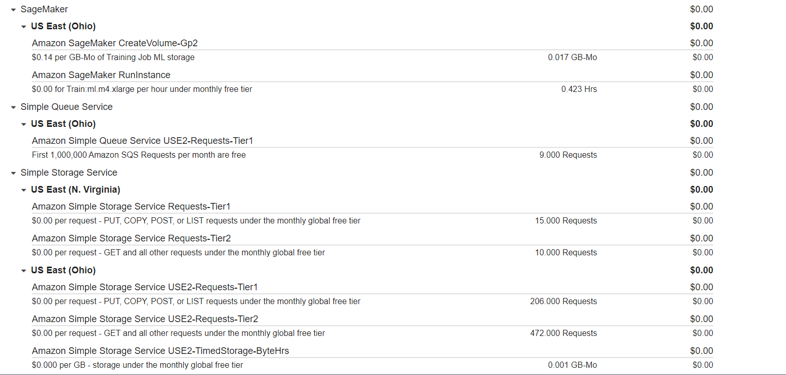
  

  
## HyperParameter Tuner jobs created in AWS Sagemaker Console:

  

  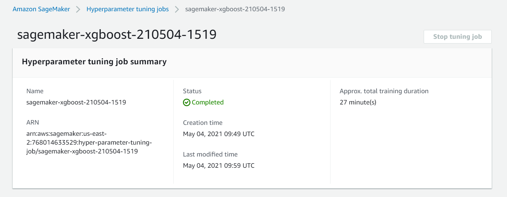
  
 
  

  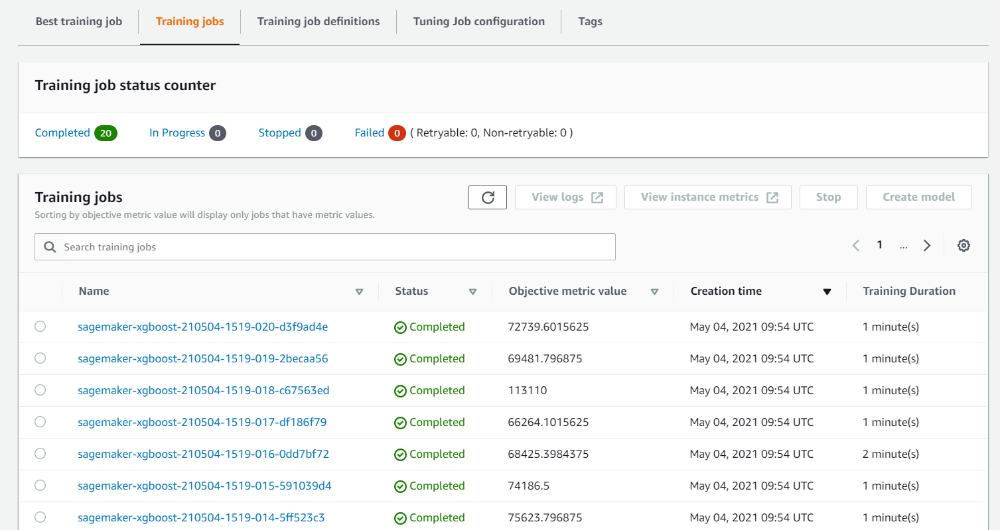
  
 
  
  - Best training job
  
  

  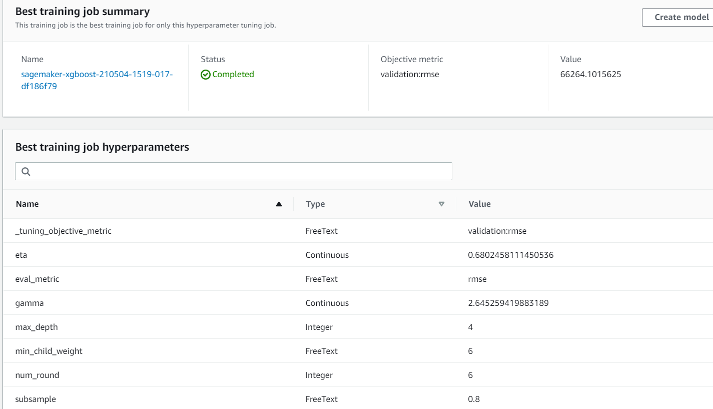
  
 

## Stacked Force Plot

  

  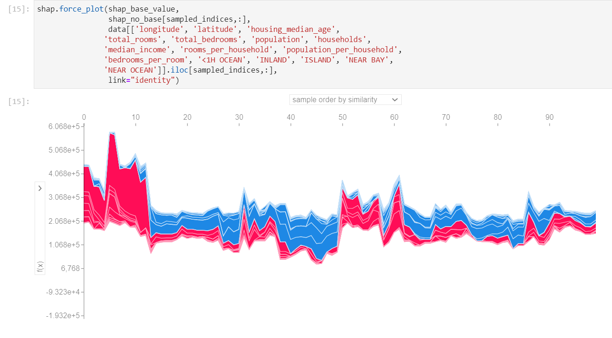
  
 
  
## Sagemaker Experiments created in AWS Sagemaker Notebook:

  

  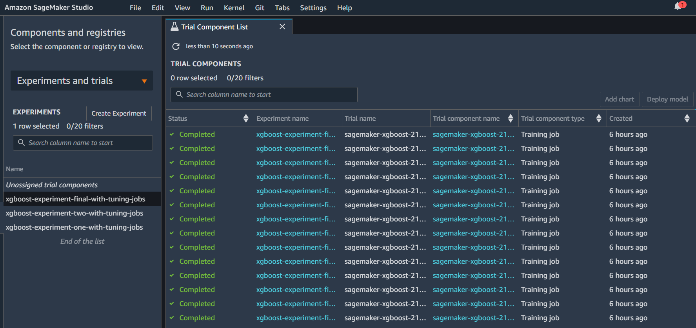
  
 

## Endpoint created in AWS Sagemaker Console:

  

  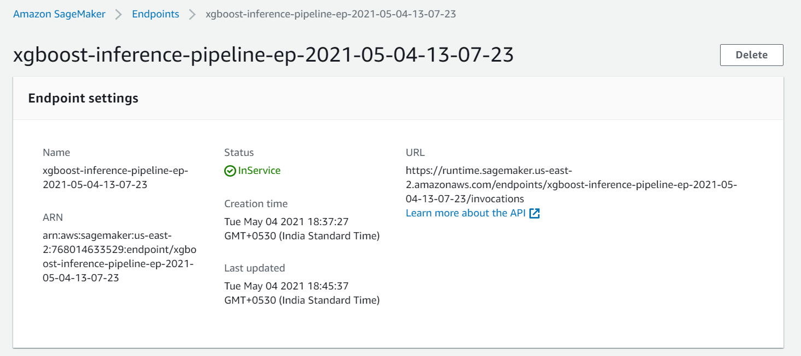
  

  

  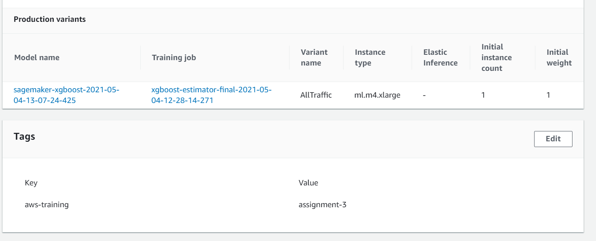
  

